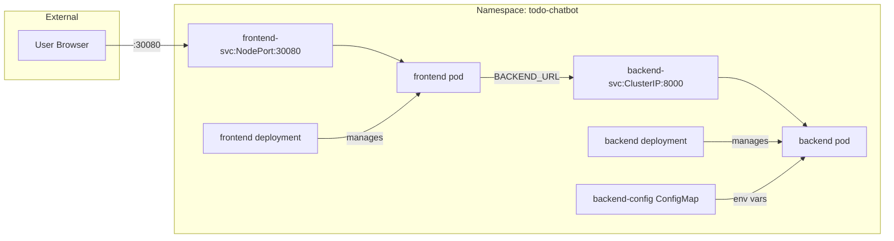

# Data Model: Kubernetes Resources for Todo Chatbot

**Feature**: 001-k8s-deployment
**Date**: 2026-02-01
**Status**: Complete

## Overview

This document defines the Kubernetes resource model for the Todo Chatbot deployment. Unlike traditional data models, this describes infrastructure entities and their relationships.

## Resource Hierarchy

```
Namespace: todo-chatbot
├── Deployment: frontend
│   └── Pod: frontend-xxxxx
│       └── Container: frontend
├── Deployment: backend
│   └── Pod: backend-xxxxx
│       └── Container: backend
├── Service: frontend-svc (NodePort)
├── Service: backend-svc (ClusterIP)
└── ConfigMap: backend-config
```

## Entity Definitions

### Namespace

| Attribute | Value | Description |
| --------- | ----- | ----------- |
| name | todo-chatbot | Logical isolation boundary |
| labels.app | todo-chatbot | Application identifier |
| labels.env | local | Environment designation |

### Frontend Deployment

| Attribute | Value | Description |
| --------- | ----- | ----------- |
| name | frontend | Deployment identifier |
| replicas | 1 | Number of pod instances |
| selector.app | frontend | Pod selection label |
| image | todo-frontend:latest | Container image |
| imagePullPolicy | Never | Use local image only |
| containerPort | 3000 | Application port |
| resources.limits.memory | 256Mi | Maximum memory |
| resources.limits.cpu | 250m | Maximum CPU |
| resources.requests.memory | 128Mi | Guaranteed memory |
| resources.requests.cpu | 100m | Guaranteed CPU |

**Environment Variables**:
| Name | Source | Description |
| ---- | ------ | ----------- |
| BACKEND_URL | ConfigMap | Backend service URL |
| NODE_ENV | Inline | production |

**Probes**:
| Probe | Path | Port | Initial Delay | Period |
| ----- | ---- | ---- | ------------- | ------ |
| liveness | /health | 3000 | 10s | 10s |
| readiness | /ready | 3000 | 5s | 5s |

### Backend Deployment

| Attribute | Value | Description |
| --------- | ----- | ----------- |
| name | backend | Deployment identifier |
| replicas | 1 | Number of pod instances |
| selector.app | backend | Pod selection label |
| image | todo-backend:latest | Container image |
| imagePullPolicy | Never | Use local image only |
| containerPort | 8000 | Application port |
| resources.limits.memory | 512Mi | Maximum memory |
| resources.limits.cpu | 500m | Maximum CPU |
| resources.requests.memory | 256Mi | Guaranteed memory |
| resources.requests.cpu | 200m | Guaranteed CPU |

**Environment Variables**:
| Name | Source | Description |
| ---- | ------ | ----------- |
| PORT | Inline | 8000 |
| LOG_LEVEL | ConfigMap | info |

**Probes**:
| Probe | Path | Port | Initial Delay | Period |
| ----- | ---- | ---- | ------------- | ------ |
| liveness | /health | 8000 | 10s | 10s |
| readiness | /ready | 8000 | 5s | 5s |

### Frontend Service (NodePort)

| Attribute | Value | Description |
| --------- | ----- | ----------- |
| name | frontend-svc | Service identifier |
| type | NodePort | Exposes service externally |
| port | 80 | Service port |
| targetPort | 3000 | Container port |
| nodePort | 30080 | External access port |
| selector.app | frontend | Routes to frontend pods |

### Backend Service (ClusterIP)

| Attribute | Value | Description |
| --------- | ----- | ----------- |
| name | backend-svc | Service identifier |
| type | ClusterIP | Internal service only |
| port | 8000 | Service port |
| targetPort | 8000 | Container port |
| selector.app | backend | Routes to backend pods |

### Backend ConfigMap

| Attribute | Value | Description |
| --------- | ----- | ----------- |
| name | backend-config | ConfigMap identifier |
| data.LOG_LEVEL | info | Logging verbosity |
| data.CORS_ORIGINS | http://frontend-svc | Allowed CORS origins |

## Relationships



## State Transitions

### Pod Lifecycle

```
Pending → ContainerCreating → Running → Terminating → (deleted)
                                ↓
                            CrashLoopBackOff (on failure)
```

### Deployment Rollout

```
Stable → Progressing → Complete
            ↓
         Failed (rollback available)
```

## Validation Rules

### Namespace

- Name MUST be lowercase alphanumeric with hyphens
- MUST have app and env labels

### Deployments

- replicas MUST be >= 1
- image MUST reference local image (no registry prefix)
- imagePullPolicy MUST be Never or IfNotPresent
- resources.limits MUST be defined
- At least one probe (liveness or readiness) MUST be defined

### Services

- selector MUST match deployment pod labels
- NodePort MUST be in range 30000-32767
- ClusterIP services MUST NOT have nodePort defined

### ConfigMaps

- Keys MUST be uppercase with underscores
- Values MUST be strings

## Labels and Selectors

### Standard Labels (all resources)

```yaml
labels:
  app.kubernetes.io/name: todo-chatbot
  app.kubernetes.io/component: frontend|backend
  app.kubernetes.io/version: "1.0.0"
  app.kubernetes.io/managed-by: helm
```

### Selector Labels

```yaml
# Frontend
selector:
  matchLabels:
    app: frontend

# Backend
selector:
  matchLabels:
    app: backend
```

## Helm Values Mapping

| Helm Value Path | K8s Resource | Field |
| --------------- | ------------ | ----- |
| namespace | Namespace | metadata.name |
| frontend.image | Frontend Deployment | spec.template.spec.containers[0].image |
| frontend.tag | Frontend Deployment | image tag |
| frontend.replicas | Frontend Deployment | spec.replicas |
| frontend.port | Frontend Deployment/Service | containerPort/targetPort |
| frontend.nodePort | Frontend Service | spec.ports[0].nodePort |
| frontend.resources | Frontend Deployment | spec.template.spec.containers[0].resources |
| backend.image | Backend Deployment | spec.template.spec.containers[0].image |
| backend.tag | Backend Deployment | image tag |
| backend.replicas | Backend Deployment | spec.replicas |
| backend.port | Backend Deployment/Service | containerPort/targetPort |
| backend.resources | Backend Deployment | spec.template.spec.containers[0].resources |
| backend.env | Backend ConfigMap | data.* |

---

**Status**: Resource model complete. Ready for Helm chart generation.
