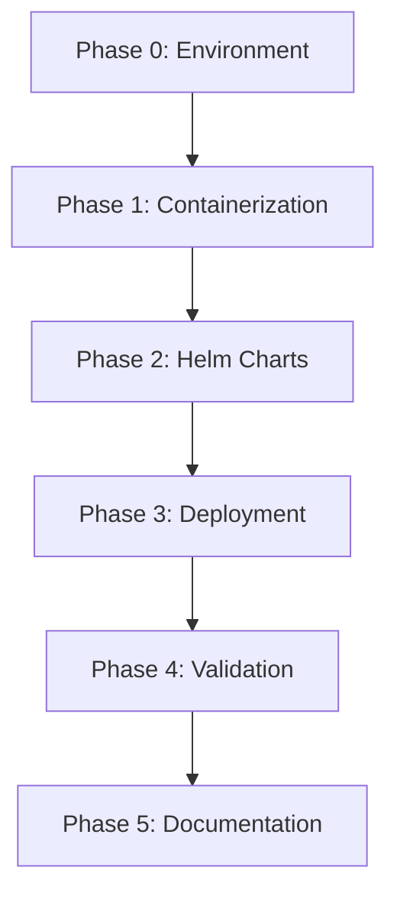

# Implementation Plan: Local Kubernetes Deployment for Todo Chatbot

**Branch**: `001-k8s-deployment` | **Date**: 2026-02-01 | **Spec**: [spec.md](./spec.md)
**Input**: Feature specification from `/specs/001-k8s-deployment/spec.md`

## Summary

Deploy the Phase III Todo Chatbot to a local Minikube Kubernetes cluster using containerized frontend and backend services managed by Helm charts. Implementation follows the Spec-Driven Development methodology with AI-assisted DevOps tools (Gordon, kubectl-ai, kagent) where available.

## Technical Context

**Language/Version**: N/A (Infrastructure/DevOps - no application code changes)
**Primary Dependencies**: Docker Desktop, Minikube, Helm 3.x, kubectl
**Storage**: N/A (stateless deployment)
**Testing**: kubectl verification, helm test, manual UI validation
**Target Platform**: Windows/macOS/Linux with Docker Desktop
**Project Type**: Web application (frontend + backend containers)
**Performance Goals**: Pods running within 2 minutes, UI loads within 5 seconds
**Constraints**: Local-only (no cloud), single-node Minikube, 8GB RAM recommended
**Scale/Scope**: 2 pods (frontend, backend), 1 Helm release, 1 namespace

## Constitution Check

*GATE: Must pass before Phase 0 research. Re-check after Phase 1 design.*

| Principle | Status | Compliance Notes |
| --------- | ------ | ---------------- |
| I. Spec-Driven Development Only | PASS | All artifacts derived from spec.md |
| II. Agentic Dev Stack Enforcement | PASS | Following Spec → Plan → Tasks → Implement flow |
| III. AI-Assisted DevOps First | PASS | Gordon, kubectl-ai, kagent identified for each phase |
| IV. Local-Only Deployment | PASS | Minikube on Docker Desktop only |
| V. Separation of Concerns | PASS | Frontend/backend independently containerized |
| VI. Reproducibility & Auditability | PASS | PHRs created, all actions traceable |
| VII. Educational Clarity | PASS | Inline comments, clear structure |

**Gate Status**: PASSED - Proceed to Phase 0

## Project Structure

### Documentation (this feature)

```text
specs/001-k8s-deployment/
├── spec.md              # Feature specification (complete)
├── plan.md              # This file
├── research.md          # Phase 0: Research findings
├── data-model.md        # Phase 1: Kubernetes resource model
├── quickstart.md        # Phase 1: Deployment quickstart guide
├── contracts/           # Phase 1: Service contracts (ports, env vars)
│   ├── frontend.yaml    # Frontend service contract
│   └── backend.yaml     # Backend service contract
├── checklists/          # Quality validation
│   └── requirements.md  # Spec quality checklist (complete)
└── tasks.md             # Phase 2: Task breakdown (via /sp.tasks)
```

### Source Code (repository root)

```text
# Existing Phase III structure (DO NOT MODIFY application code)
frontend/                # Phase III frontend source
├── src/
├── package.json
└── Dockerfile           # TO BE CREATED by this plan

backend/                 # Phase III backend source
├── src/
├── requirements.txt     # or package.json
└── Dockerfile           # TO BE CREATED by this plan

# New infrastructure artifacts
charts/
└── todo-chatbot/
    ├── Chart.yaml
    ├── values.yaml
    ├── .helmignore
    └── templates/
        ├── _helpers.tpl
        ├── namespace.yaml
        ├── frontend/
        │   ├── deployment.yaml
        │   └── service.yaml
        └── backend/
            ├── deployment.yaml
            ├── service.yaml
            └── configmap.yaml
```

**Structure Decision**: Web application structure with separate frontend/backend directories. Infrastructure artifacts added in `charts/` directory at repository root.

## Implementation Phases

### Phase 0: Environment Preparation & Research

**Objective**: Validate prerequisites and resolve technical unknowns

| Step | Description | AI Tool | Fallback | Output |
| ---- | ----------- | ------- | -------- | ------ |
| 0.1 | Verify Docker Desktop installation | Claude Code | Manual check | docker info success |
| 0.2 | Verify Minikube installation | Claude Code | Manual check | minikube version success |
| 0.3 | Verify Helm installation | Claude Code | Manual check | helm version success |
| 0.4 | Verify kubectl installation | Claude Code | Manual check | kubectl version success |
| 0.5 | Research Phase III codebase structure | Claude Code | Manual inspection | research.md |
| 0.6 | Identify base images for frontend/backend | Gordon (Docker AI) | DockerHub search | research.md |

**Gate**: All tools verified, codebase structure understood

---

### Phase 1: Containerization

**Objective**: Create Docker images for frontend and backend

| Step | Description | AI Tool | Fallback | Output |
| ---- | ----------- | ------- | -------- | ------ |
| 1.1 | Analyze frontend source for Dockerfile requirements | Gordon | Claude Code analysis | Frontend Dockerfile strategy |
| 1.2 | Generate frontend Dockerfile | Gordon | Claude Code | frontend/Dockerfile |
| 1.3 | Analyze backend source for Dockerfile requirements | Gordon | Claude Code analysis | Backend Dockerfile strategy |
| 1.4 | Generate backend Dockerfile | Gordon | Claude Code | backend/Dockerfile |
| 1.5 | Start Minikube cluster | Claude Code | minikube start | Cluster running |
| 1.6 | Configure Docker to use Minikube daemon | Claude Code | eval $(minikube docker-env) | Environment configured |
| 1.7 | Build frontend image | Gordon / docker build | docker build | todo-frontend:latest |
| 1.8 | Build backend image | Gordon / docker build | docker build | todo-backend:latest |
| 1.9 | Verify images in Minikube | Claude Code | docker images | Both images listed |

**Gate**: Both images built and available in Minikube's Docker daemon

---

### Phase 2: Helm Chart Creation

**Objective**: Generate Helm chart structure and templates

| Step | Description | AI Tool | Fallback | Output |
| ---- | ----------- | ------- | -------- | ------ |
| 2.1 | Create Helm chart scaffold | kagent / helm create | helm create | charts/todo-chatbot/ |
| 2.2 | Generate Chart.yaml metadata | Claude Code | Manual | charts/todo-chatbot/Chart.yaml |
| 2.3 | Generate values.yaml configuration | kagent | Claude Code | charts/todo-chatbot/values.yaml |
| 2.4 | Generate namespace template | kubectl-ai | Claude Code | templates/namespace.yaml |
| 2.5 | Generate frontend deployment template | kubectl-ai | Claude Code | templates/frontend/deployment.yaml |
| 2.6 | Generate frontend service template | kubectl-ai | Claude Code | templates/frontend/service.yaml |
| 2.7 | Generate backend deployment template | kubectl-ai | Claude Code | templates/backend/deployment.yaml |
| 2.8 | Generate backend service template | kubectl-ai | Claude Code | templates/backend/service.yaml |
| 2.9 | Generate backend configmap template | kubectl-ai | Claude Code | templates/backend/configmap.yaml |
| 2.10 | Generate _helpers.tpl | Claude Code | Manual | templates/_helpers.tpl |
| 2.11 | Generate NOTES.txt | Claude Code | Manual | templates/NOTES.txt |
| 2.12 | Validate chart with helm lint | Claude Code | helm lint | No errors |

**Gate**: Helm chart passes lint validation

---

### Phase 3: Deployment

**Objective**: Deploy application to Minikube via Helm

| Step | Description | AI Tool | Fallback | Output |
| ---- | ----------- | ------- | -------- | ------ |
| 3.1 | Install Helm release | Claude Code | helm install | Release created |
| 3.2 | Verify namespace created | kubectl-ai | kubectl get ns | todo-chatbot namespace exists |
| 3.3 | Verify pods are running | kubectl-ai | kubectl get pods | 2/2 pods Running |
| 3.4 | Verify services created | kubectl-ai | kubectl get svc | frontend-svc, backend-svc exist |
| 3.5 | Get frontend service URL | Claude Code | minikube service | NodePort URL available |

**Gate**: Both pods running, services accessible

---

### Phase 4: Validation & Verification

**Objective**: Confirm application functionality and document results

| Step | Description | AI Tool | Fallback | Output |
| ---- | ----------- | ------- | -------- | ------ |
| 4.1 | Access frontend in browser | Manual | curl | UI loads |
| 4.2 | Test chatbot interaction | Manual | curl to backend | Responses returned |
| 4.3 | Analyze cluster health | kagent | kubectl describe | Health report |
| 4.4 | Document deployment verification | Claude Code | Manual | Verification checklist |
| 4.5 | Test helm uninstall cleanup | Claude Code | helm uninstall | All resources removed |
| 4.6 | Reinstall for final state | Claude Code | helm install | Application running |

**Gate**: All success criteria (SC-001 through SC-008) verified

---

### Phase 5: Documentation & PHR

**Objective**: Complete documentation and create audit trail

| Step | Description | AI Tool | Fallback | Output |
| ---- | ----------- | ------- | -------- | ------ |
| 5.1 | Generate quickstart.md | Claude Code | Manual | quickstart.md |
| 5.2 | Create PHRs for each major phase | Claude Code | Manual | history/prompts/001-k8s-deployment/*.md |
| 5.3 | Update agent context | Claude Code | Manual | .specify/agents/claude.md |
| 5.4 | Final constitution compliance check | Claude Code | Manual | All principles verified |

**Gate**: All documentation complete, PHRs created

## AI Tool Usage Summary

| Tool | Primary Use Cases | Steps |
| ---- | ----------------- | ----- |
| **Gordon (Docker AI)** | Dockerfile generation, image optimization | 1.1-1.4, 1.7-1.8 |
| **kubectl-ai** | K8s manifest generation, pod troubleshooting | 2.4-2.9, 3.2-3.4 |
| **kagent** | Helm chart analysis, cluster health | 2.1, 2.3, 4.3 |
| **Claude Code** | Orchestration, fallback, documentation | All steps |

## Fallback Strategy

If AI DevOps tools are unavailable:

1. **Document unavailability** in PHR with specific error/reason
2. **Use standard CLI** equivalents:
   - Gordon → `docker build` with manually crafted Dockerfile
   - kubectl-ai → `kubectl apply` with Claude Code-generated YAML
   - kagent → `helm create` + `helm lint` + Claude Code templates
3. **Note fallback** in final deliverables and ensure at least one AI tool usage is demonstrated

## Complexity Tracking

> No constitution violations. All requirements align with principles.

| Aspect | Decision | Rationale |
| ------ | -------- | --------- |
| Single Helm chart | One chart for both services | Simplicity per Principle VII; services are tightly coupled |
| No Ingress | NodePort only | Local-only per Principle IV; Ingress adds unnecessary complexity |
| No HPA | Fixed replicas | Scale not required per Non-Goals; adds complexity |
| No PVC | Stateless | No persistent storage per Non-Goals |

## Risk Assessment

| Risk | Likelihood | Impact | Mitigation |
| ---- | ---------- | ------ | ---------- |
| AI tools unavailable | Medium | Low | Fallback to standard CLI documented |
| Phase III code incompatible | Low | High | Research phase validates codebase first |
| Minikube resource constraints | Medium | Medium | 8GB RAM recommended in prerequisites |
| Image pull errors | Low | Medium | Using imagePullPolicy: Never for local images |

## Dependencies



## Success Criteria Mapping

| Success Criterion | Verification Step | Phase |
| ----------------- | ----------------- | ----- |
| SC-001: Pods Running | 3.3, 4.1 | 3, 4 |
| SC-002: UI Accessible | 4.1 | 4 |
| SC-003: E2E Interaction | 4.2 | 4 |
| SC-004: Clean Uninstall | 4.5 | 4 |
| SC-005: <10min Deploy | Full workflow timing | All |
| SC-006: AI Tool Usage | PHR documentation | 5 |
| SC-007: Namespace Isolation | 3.2 | 3 |
| SC-008: Traceability | 5.2-5.4 | 5 |

---

**Next Step**: Run `/sp.tasks` to generate atomic, executable task list.
